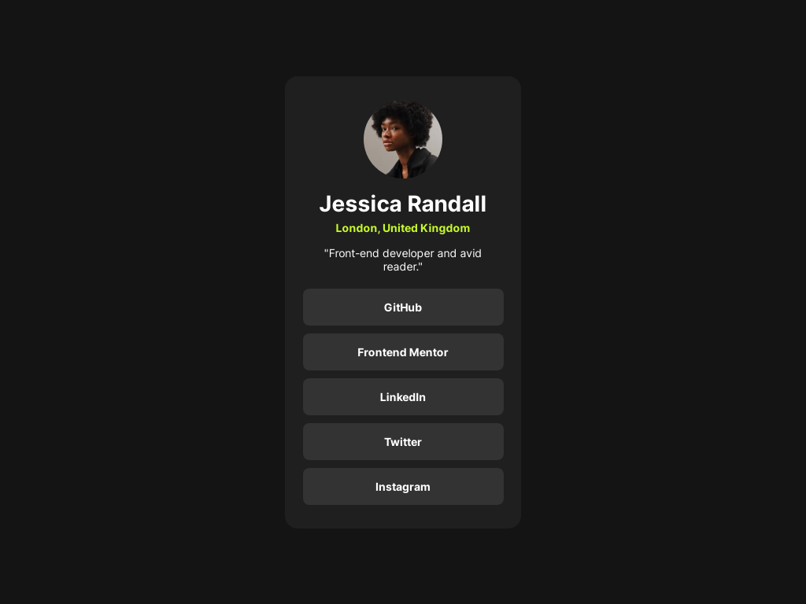

# Frontend Mentor - Social links profile solution

This is a solution to the [Social links profile challenge on Frontend Mentor](https://www.frontendmentor.io/challenges/social-links-profile-UG32l9m6dQ). Frontend Mentor challenges help you improve your coding skills by building realistic projects. 

## Table of contents

- [Overview](#overview)
  - [The challenge](#the-challenge)
  - [Screenshot](#screenshot)
  - [Links](#links)
- [My process](#my-process)
  - [Built with](#built-with)
  - [What I learned](#what-i-learned)
  - [Continued development](#continued-development)
- [Author](#author)

**Note: Delete this note and update the table of contents based on what sections you keep.**

## Overview

### The challenge

Create a social link card profile with on hover effect for the button

### Screenshot

### Links

- Live Site URL: [https://hasban-fardani.github.io/frontendmentor-social-links-profile/](https://hasban-fardani.github.io/frontendmentor-social-links-profile/)

## My process

### Built with

- Semantic HTML5 markup
- CSS3
- Flexbox
- Mobile-first workflow

### What I learned

- how to center a div

### Continued development

I want to up skills html css js native for LKS competition preparation

## Author

- Website - [Hasban Fardani](https://www.hasban-fardani.github.io)
- Frontend Mentor - [@Hasban-Fardani](https://www.frontendmentor.io/profile/Hasban-Fardani)
